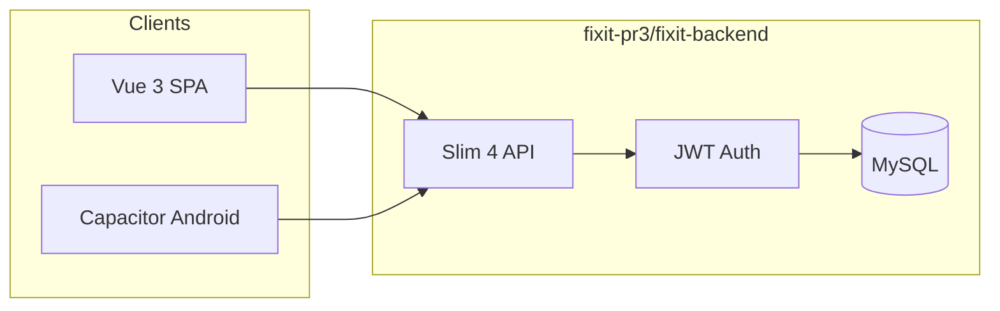

# FixIt

On-demand local home-services marketplace — milestone-based monorepo.

## Repository layout

```
├── fixit/              PR1 — interactive UI mockup (React/JSX design canvas)
├── fixit-pr2/          PR2 — Vue 3 interim build (mock JSON, no backend)
├── fixit-pr3/          PR3 — full-stack Vue 3 + PHP Slim 4 + MySQL + Android
│   ├── fixit-frontend/
│   └── fixit-backend/
├── docs/               Architecture decision records
└── SECURITY.md         Security audit & production checklist
```

| Milestone | Folder | What it is |
|-----------|--------|------------|
| **PR1** | [fixit/](fixit/) | Design canvas mockup |
| **PR2** | [fixit-pr2/](fixit-pr2/) | Vue SPA with local JSON mocks |
| **PR3** | [fixit-pr3/](fixit-pr3/) | **Current** — live API, KYC, Stripe, E2E chat, Android |

## Quick start (PR3)

All commands run from `fixit-pr3/`:

```bash
# Database
mysql -u root -p < fixit-pr3/fixit-backend/schema.sql
mysql -u root -p < fixit-pr3/fixit-backend/seed.sql

# Backend → http://localhost:8080/api/health
cd fixit-pr3/fixit-backend && cp .env.example .env && composer install && composer start

# Frontend → http://localhost:5173
cd fixit-pr3/fixit-frontend && npm install && cp .env.example .env && npm run dev
```

Full PR3 guide: [fixit-pr3/README.md](fixit-pr3/README.md)

## Demo accounts (PR3)

Password: `password123`

| Role | Email |
|------|-------|
| Customer | alex@email.com |
| Provider | marcus@email.com |
| Admin | admin@fixit.com |

## Architecture (PR3)



## Development docs

| Document | Purpose |
|----------|---------|
| [fixit-pr3/README.md](fixit-pr3/README.md) | PR3 overview & quick start |
| [fixit-pr3/fixit-frontend/README.md](fixit-pr3/fixit-frontend/README.md) | SPA setup, build, Android |
| [fixit-pr3/fixit-backend/README.md](fixit-pr3/fixit-backend/README.md) | API setup, MySQL, Composer |
| [fixit-pr2/README.md](fixit-pr2/README.md) | PR2 mock-data architecture |
| [SECURITY.md](SECURITY.md) | Audit findings & production checklist |
| [docs/adr/0001-separate-frontend-backend.md](docs/adr/0001-separate-frontend-backend.md) | ADR: split deployment |

## License

Private project — all rights reserved unless otherwise specified by the repository owner.