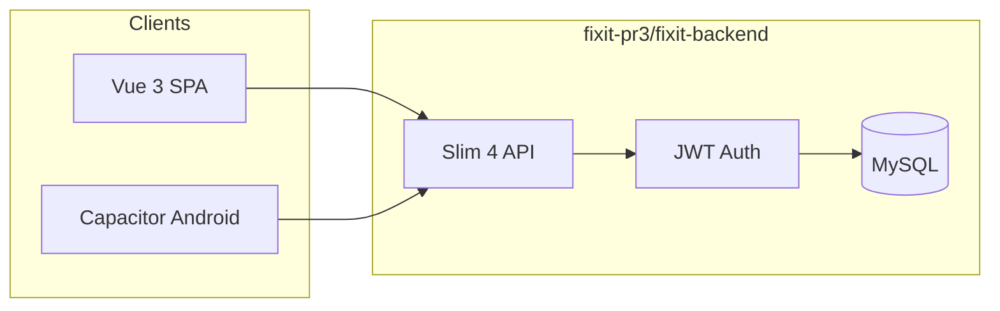

# FixIt

On-demand local home-services marketplace — full-stack PR3 build with Vue 3 frontend, PHP Slim 4 API, MySQL, E2E encrypted chat, harm-message review, and Capacitor Android app.

## Repository layout

```
├── fixit/              PR1 — interactive UI mockup (React/JSX design canvas)
├── fixit-pr2/          PR2 — Vue 3 interim build (mock JSON, no backend)
├── fixit-pr3/          PR3 — full-stack Vue 3 + PHP Slim 4 + MySQL + Android
│   ├── fixit-frontend/ Vue 3 + Vite SPA + Capacitor Android (live API)
│   └── fixit-backend/  PHP Slim 4 REST API + MySQL
├── docs/               Architecture decision records
└── SECURITY.md         Security audit & production checklist
```

**PR3** (`fixit-pr3/fixit-frontend` + `fixit-pr3/fixit-backend`) is the current full-stack app. **PR2** and **PR1** folders are kept as earlier milestones for reference.

Frontend and backend deploy separately. No Docker required.

## Features

| Area | Details |
|------|---------|
| **Roles** | Customer, provider, admin with JWT + role guards |
| **Marketplace** | Browse providers by category, map search, bookings, reviews |
| **Provider KYC** | OCR + MRZ + anti-spoof ID checks + 8-colour face liveness |
| **Payments** | Stripe test mode (SetupIntent + saved test card) |
| **Registration** | Slider puzzle captcha + Terms/Privacy policy acceptance |
| **E2E chat** | AES-256-GCM messages; server stores ciphertext only |
| **PIN unlock** | RSA-2048 keypair; private key wrapped with PIN (PBKDF2) for new devices |
| **Harm review** | Client-side screening; flagged metadata queued for admin |
| **Android** | Capacitor app with geolocation, status bar, back-button handling |
| **Security** | Prepared statements, rate limiting, CORS lockdown, security headers |

## Quick start

### Prerequisites

- **Backend:** PHP 8.1+, Composer, MySQL 8.0+
- **Frontend:** Node.js 18+, npm
- **Android (optional):** Android Studio, Java 17+

### 1. Database

```bash
mysql -u root -p < fixit-pr3/fixit-backend/schema.sql
mysql -u root -p < fixit-pr3/fixit-backend/seed.sql
mysql -u root -p < fixit-pr3/fixit-backend/migrations/002_e2e_crypto_harm.sql
mysql -u root -p < fixit-pr3/fixit-backend/migrations/003_kyc_verification.sql
mysql -u root -p < fixit-pr3/fixit-backend/migrations/004_stripe_payments.sql
mysql -u root -p < fixit-pr3/fixit-backend/migrations/005_legal_acceptance.sql
```

Create a least-privilege MySQL user (see [fixit-pr3/fixit-backend/README.md](fixit-pr3/fixit-backend/README.md)).

### 2. Backend

```bash
cd fixit-pr3/fixit-backend
cp .env.example .env
# Edit DB_* and JWT_SECRET (≥32 characters)
composer install
composer start
# → http://localhost:8080/api/health
```

### 3. Frontend (web)

```bash
cd fixit-pr3/fixit-frontend
npm install
cp .env.example .env
# VITE_API_URL=http://localhost:8080/api
npm run dev
# → http://localhost:5173
```

### 4. Android app (optional)

```bash
cd fixit-pr3/fixit-frontend
cp .env.android.example .env.production.local
# Set VITE_API_URL (emulator: http://10.0.2.2:8080/api)
npm run cap:sync
npm run cap:android
```

Full mobile guide: [fixit-pr3/fixit-frontend/ANDROID.md](fixit-pr3/fixit-frontend/ANDROID.md)

## Demo accounts

Seed password for all users: `password123` (change before production).

| Role | Email |
|------|-------|
| Customer | alex@email.com |
| Provider | marcus@email.com |
| Admin | admin@fixit.com |

## API

- **Base URL:** `/api`
- **Auth:** `Authorization: Bearer <token>`
- **Health:** `GET /api/health`

### Main route groups

| Group | Endpoints |
|-------|-----------|
| Auth | `POST /auth/register`, `POST /auth/login`, captcha challenge/verify |
| Catalog | `GET /categories`, `GET /providers`, `GET /providers/{id}` |
| KYC | `GET/POST /providers/{id}/kyc/*` (ID recognition + liveness) |
| Payments | Stripe config, setup-intent, save/pay with test card |
| Bookings | CRUD + status updates (customer/provider) |
| Reviews | Create + list per provider |
| Crypto | PIN setup/verify, RSA keys, per-job AES key exchange |
| Messages | Encrypted job chat (`GET/POST /jobs/{id}/messages`) |
| Admin | Provider verification, users, reviews, harm-review queue |

## Architecture



- **Frontend** calls the API via `fixit-pr3/fixit-frontend/src/services/api.js`
- **E2E crypto** runs in the browser/app (`crypto.js`, `chatCrypto.js`); backend stores wrapped keys and ciphertext
- **Harm screening** runs client-side before encryption (`harmReview.js`)

## Production deployment

1. Read [SECURITY.md](SECURITY.md) and complete both checklists (backend + frontend).
2. Set `APP_DEBUG=false`, strong `JWT_SECRET`, and exact `CORS_ORIGIN`.
3. Build frontend with production API URL:
   ```bash
   cd fixit-pr3/fixit-frontend
   VITE_API_URL=https://your-api.example.com/api npm run build
   ```
4. Serve `fixit-pr3/fixit-frontend/dist/` from any static host (nginx, Netlify, Render, S3).
5. Run backend behind HTTPS with `composer install --no-dev`.

## Earlier milestones

| Folder | Milestone | Run |
|--------|-----------|-----|
| [fixit/](fixit/) | PR1 UI mockup | Open `fixit/FixIt.html` or run `node fixit/server.js` |
| [fixit-pr2/](fixit-pr2/) | PR2 Vue interim (mock data) | `cd fixit-pr2 && npm install && npm run dev` |
| [fixit-pr3/](fixit-pr3/) | PR3 full-stack (current) | See [fixit-pr3/README.md](fixit-pr3/README.md) |

## Development docs

| Document | Purpose |
|----------|---------|
| [fixit-pr3/README.md](fixit-pr3/README.md) | PR3 milestone overview |
| [fixit-pr3/fixit-frontend/README.md](fixit-pr3/fixit-frontend/README.md) | SPA setup, build, demo logins |
| [fixit-pr3/fixit-backend/README.md](fixit-pr3/fixit-backend/README.md) | API setup, MySQL, Composer |
| [fixit-pr2/README.md](fixit-pr2/README.md) | PR2 mock-data architecture & migration notes |
| [SECURITY.md](SECURITY.md) | Audit findings, E2E crypto notes, CSP |
| [docs/adr/0001-separate-frontend-backend.md](docs/adr/0001-separate-frontend-backend.md) | ADR: split deployment |

## License

Private project — all rights reserved unless otherwise specified by the repository owner.