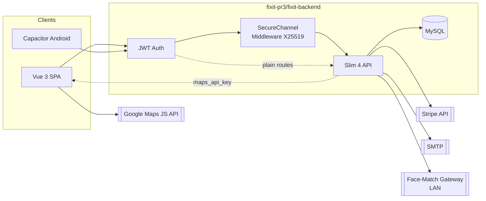
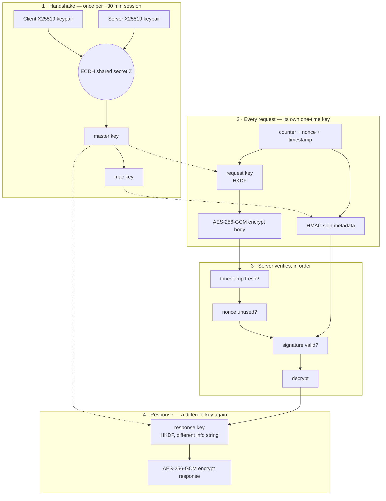

# FixIt

<p align="center">
  
</p>

On-demand local home-services marketplace — full-stack PR3 build with Vue 3 frontend, PHP Slim 4 API, MySQL, E2E encrypted chat, harm-message review, and Capacitor Android app.

**Live:** [https://fixit.olgtx.com](https://fixit.olgtx.com) · API base: `https://fixit.olgtx.com/api`

## Repository layout

```
├── fixit/              PR1 — interactive UI mockup (React/JSX design canvas)
├── fixit-pr2/          PR2 — Vue 3 interim build (mock JSON, no backend)
├── fixit-meituan-ui/   Meituan-style UI rebuild (reversed from Meituan APK)
├── fixit-pr3/          PR3 — full-stack Vue 3 + PHP Slim 4 + MySQL + Android
│   ├── fixit-frontend/ Vue 3 + Vite SPA + Capacitor Android (live API)
│   └── fixit-backend/  PHP Slim 4 REST API + MySQL
├── docs/               Architecture decision records
└── SECURITY.md         Security audit & production checklist
```

**PR3** (`fixit-pr3/fixit-frontend` + `fixit-pr3/fixit-backend`) is the current full-stack app. **PR2** and **PR1** folders are kept as earlier milestones for reference.

Frontend and backend deploy separately. No Docker required.

## Features

| Area | Details |
|------|---------|
| **Roles** | Customer, provider, admin with JWT + role guards |
| **Marketplace** | Browse providers by category, map search, bookings, reviews |
| **Provider KYC** | OCR + MRZ + anti-spoof ID checks + 8-colour face liveness |
| **Payments** | Stripe test mode (SetupIntent + saved test card) |
| **Registration** | Slider puzzle captcha + Terms/Privacy policy acceptance |
| **E2E chat** | AES-256-GCM messages; server stores ciphertext only; auto-refreshes every 3s |
| **PIN unlock** | RSA-2048 keypair; private key wrapped with PIN (PBKDF2) for new devices |
| **Order history** | Order Details page (customer/provider/admin) with a submit → paid → accepted → in-progress → completed timeline and synced avatars |
| **Per-interaction encryption** | X25519 handshake + HKDF + AES-256-GCM + HMAC on every payment, chat, and order-detail request (same channel as Stripe writes); live in the Encryption Debug capsule |
| **Chat notifications** | Direct client-side notifications (Web Notifications API / Capacitor Local Notifications) — no FCM, no push server, no device tokens |
| **Harm review** | Client-side screening; flagged metadata queued for admin |
| **Android** | Capacitor app with geolocation, status bar, local notifications, back-button handling |
| **Security** | Prepared statements, rate limiting, CORS lockdown, security headers |

## Quick start

### Prerequisites

- **Backend:** PHP 8.1+, Composer, MySQL 8.0+
- **Frontend:** Node.js 18+, npm
- **Android (optional):** Android Studio, Java 17+

### 1. Database

```bash
mysql -u root -p < fixit-pr3/fixit-backend/schema.sql
mysql -u root -p < fixit-pr3/fixit-backend/seed.sql
for f in fixit-pr3/fixit-backend/migrations/*.sql; do mysql -u root -p < "$f"; done
```

Create a least-privilege MySQL user (see [fixit-pr3/fixit-backend/README.md](fixit-pr3/fixit-backend/README.md)).

### 2. Backend

```bash
cd fixit-pr3/fixit-backend
cp .env.example .env
# Edit DB_* and JWT_SECRET (≥32 characters)
composer install
composer start
# → http://localhost:8080/api/health
```

### 3. Frontend (web)

```bash
cd fixit-pr3/fixit-frontend
npm install
cp .env.example .env
# VITE_API_URL=http://localhost:8080/api
npm run dev
# → http://localhost:5173
```

### 4. Android app (optional)

```bash
cd fixit-pr3/fixit-frontend
cp .env.android.example .env.production.local
# Set VITE_API_URL (emulator: http://10.0.2.2:8080/api)
npm run cap:sync
npm run cap:android
```

Full mobile guide: [fixit-pr3/fixit-frontend/ANDROID.md](fixit-pr3/fixit-frontend/ANDROID.md)

## Demo accounts

Seed password for all users: `password123` (change before production).

| Role | Email |
|------|-------|
| Customer | alex@email.com |
| Provider | marcus@email.com |
| Admin | admin@fixit.com |

## API

- **Base URL:** `/api`
- **Auth:** `Authorization: Bearer <token>`
- **Health:** `GET /api/health`

### Main route groups

| Group | Endpoints |
|-------|-----------|
| Auth | `POST /auth/register`, `POST /auth/login`, captcha challenge/verify |
| Catalog | `GET /categories`, `GET /providers`, `GET /providers/{id}` |
| KYC | `GET/POST /providers/{id}/kyc/*` (ID recognition + liveness) |
| Payments | Stripe config, setup-intent, save/pay with test card |
| Bookings | CRUD + status updates (customer/provider); `GET /bookings/{id}` returns the full order-history timeline + `paid_at` |
| Reviews | Create + list per provider |
| Crypto | PIN setup/verify, RSA keys, per-job AES key exchange |
| Messages | Encrypted job chat (`GET/POST /jobs/{id}/messages`) |
| Admin | Provider verification, users, reviews, harm-review queue |

`POST /bookings`, `PATCH/DELETE /bookings/{id}`, `GET /bookings/{id}`, and both `/jobs/{id}/messages` routes ride the same per-interaction encrypted channel as Stripe payments (`SecureChannelMiddleware`, X25519 handshake via `POST /secure/handshake`). GET requests carry their encrypted payload in an `X-Sec-Body` header (fetch forbids a GET body).

## Architecture



- **Frontend** calls the API via `fixit-pr3/fixit-frontend/src/services/api.js`
- **E2E crypto** runs in the browser/app (`crypto.js`, `chatCrypto.js`); backend stores wrapped keys and ciphertext
- **Per-interaction channel** (`secureTransport.js` ↔ `SecureChannelMiddleware.php`) wraps payments, chat, and order-detail requests — separate from and on top of the chat's own E2E ciphertext
- **Chat notifications** are client-side only (`services/push.js` polls `/bookings` and fires a local notification) — no FCM/APNs, no server push infrastructure
- **Harm screening** runs client-side before encryption (`harmReview.js`)
- **Google Maps** — the backend only hands the browser its API key (`GET /api/config/maps`, origin-checked); the browser loads Google's JS SDK directly, the key is never bundled into source
- **KYC face-match** — the backend calls a LAN gateway server-side to compare the ID photo against the live selfie; the browser never talks to it directly

### Encryption Debug Capsule

A small floating lock button (bottom-left corner of the app, purple) lets anyone watch the
per-interaction encryption channel work in real time — useful for demos, since it's live proof
the channel actually encrypts/decrypts rather than a claim on a slide.

Click it to open a panel showing, for the most recent secure-channel request:
- **↑ encrypt — before**: the plaintext payload, as the app built it
- **↑ encrypt — after**: the AES-256-GCM ciphertext actually sent over the wire (base64)
- **↓ decrypt — before**: the encrypted response ciphertext that came back
- **↓ decrypt — after**: the plaintext after the app decrypted it

A `‹ older` / `newer ›` nav flips through the last 25 captured requests, and the badge on the
closed button shows how many have been captured this session. Trigger one by doing anything that
rides the secure channel — booking, paying, opening Order Details, or sending a chat message.

Implementation: `secureTransport.js` pushes every request into a small reactive `secureDebug`
store as it happens; `DebugCapsule.vue` just renders that store — it doesn't intercept or decrypt
anything on its own, it shows exactly what the real request/response cycle did.

### Per-interaction encryption pipeline

**In plain terms:** every payment, chat message, and order-detail request gets wrapped in its own
throwaway lock and key, generated fresh for that one request and never reused. Even someone who
captures the traffic and later steals the server's keys can't unlock old messages, can't replay a
captured request to trigger it again, and can't tamper with a message in transit without the
server noticing and rejecting it outright.

How that's actually achieved (implemented identically in `secureTransport.js` on the client and
`SecureChannelMiddleware.php` + `SecureChannel.php` on the server):



Full technical diagram with every field: [PR3_Diagrams.puml.md](fixit-pr3/doc/PR3_Diagrams.puml.md#extra--key-derivation--encryption-pipeline-x25519--hkdf--aes-256-gcm--hmac).

**1. Handshake (once per ~30 min session)** — think of this as the app and server agreeing on a
shared secret without ever sending that secret over the network (a Diffie-Hellman key exchange).
Both sides end up holding the same two keys — one for encrypting, one for signing — that only ever
exist in memory and are never transmitted again.

**2. Every request gets its own one-time key** — instead of encrypting everything with one fixed
key for the whole session, each individual request derives a brand-new key just for itself, then
encrypts its data with that key and separately signs the request details (so tampering with either
the data or the "envelope" it travels in is detectable).

**3. The server checks three things before trusting anything** — is this request recent (not an
old one being replayed)? has this exact request been seen before (reject duplicates)? does the
signature actually match? Only if all three pass does it bother decrypting.

**4. The reply back is locked with yet another different key** — so a request and its response
never share a key either.

| What we did | Why it matters, in plain terms |
|---|---|
| Fresh, throwaway session keys | If a key is ever compromised later, it can't be used to read *past* conversations — there's nothing old left to unlock |
| A brand-new key for every request | No two messages are ever protected by the same key, so cracking one tells you nothing about any other |
| Authenticated encryption (AES-256-GCM) | The server can tell if a message was tampered with in transit — not just "unreadable," but "rejected as invalid" |
| A separate signature on the request details | Even the *metadata* (which endpoint, what time) is tamper-proof, not just the message content |
| Reject anything old or already seen | Someone who captures a real request can't just resend it later and have it work again |

## Production deployment

1. Read [SECURITY.md](SECURITY.md) and complete both checklists (backend + frontend).
2. Set `APP_DEBUG=false`, strong `JWT_SECRET`, and exact `CORS_ORIGIN`.
3. **Backend** — deploy behind nginx + PHP-FPM (see [fixit-pr3/fixit-backend/README.md](fixit-pr3/fixit-backend/README.md#production--aapanel--nginx--php-fpm)):
   - Upload to `/www/wwwroot/<domain>/`
   - Nginx `root` must be `.../public` with Slim `try_files` rewrite
   - `composer install --no-dev` once; **do not** run `composer start` on the server
   - Start stack: `/etc/init.d/php-fpm-85 start` and `nginx -t && /etc/init.d/nginx reload`
   - Disable aaPanel’s `fixit.olgtx.com.service` if it runs `php composer start`
4. Build frontend with production API URL:
   ```bash
   cd fixit-pr3/fixit-frontend
   VITE_API_URL=https://fixit.olgtx.com/api npm run build
   ```
5. Serve `fixit-pr3/fixit-frontend/dist/` from any static host (nginx, Netlify, Render, S3).

## Deployment credentials & secrets

**Never commit real credential values to git or paste them into docs, slides, or screenshots.**
Rotate any secret that's ever shown in a screen share, recording, or classroom demo — a shown
secret should be treated as compromised, even shown "just once."

The CI/CD pipeline (`.github/workflows/deploy.yml`, `release-apk.yml`) needs these **GitHub
Actions secrets** (Settings → Secrets and variables → Actions → New repository secret — GitHub
never displays a secret's value again after it's saved, only its name):

| Secret | Used for |
|--------|----------|
| `SSH_HOST`, `SSH_PORT` | Address of the production server for the auto-redeploy job |
| `SSH_KEY` | Private key for the `deploy` SSH user (public key installed on the server) |
| `ANDROID_KEYSTORE_BASE64` | Base64-encoded release keystore for signing the Android APK |
| `ANDROID_STORE_PASSWORD`, `ANDROID_KEY_ALIAS`, `ANDROID_KEY_PASSWORD` | Keystore/key passwords for signing |

`GITHUB_TOKEN` is provided automatically by Actions — nothing to configure.

The **backend** reads its own secrets from `fixit-pr3/fixit-backend/.env` (git-ignored, never
committed) — see [`.env.example`](fixit-pr3/fixit-backend/.env.example) for the template with
placeholder values only. Every variable it defines:

| Variable | Purpose |
|----------|---------|
| `DB_HOST`, `DB_PORT`, `DB_NAME`, `DB_USER`, `DB_PASS` | MySQL connection |
| `JWT_SECRET` | Signs/verifies auth tokens — ≥32 random characters |
| `CORS_ORIGIN` | Comma-separated allow-list of origins permitted to call the API |
| `APP_DEBUG` | Must be `false` in production (hides stack traces from responses) |
| `SMTP_HOST`, `SMTP_PORT`, `SMTP_USER`, `SMTP_PASS`, `SMTP_FROM_EMAIL`, `SMTP_FROM_NAME` | Outgoing mail for the email-OTP flow |
| `GOOGLE_MAPS_API_KEY` | Maps JS key, served to the client via `GET /api/config/maps` (restrict by HTTP referrer + API in Google Cloud Console — see the fix in commit history) |
| `STRIPE_MODE`, `STRIPE_SECRET_KEY`, `STRIPE_PUBLISHABLE_KEY`, `STRIPE_WEBHOOK_SECRET` | Stripe test-mode payments — never put live (`sk_live_`/`pk_live_`) keys here |
| `FACE_MATCH_URL`, `FACE_MATCH_API_KEY`, `FACE_MATCH_MIN_SCORE` | LAN face-match gateway used by KYC (ID photo vs. live selfie) |

**To prove to a reviewer/grader that credentials are configured and working, without exposing
any value:**
- GitHub → Settings → Secrets and variables → Actions — shows every secret **name** (values
  permanently masked).
- GitHub → Actions tab — a green run of `deploy.yml` proves the SSH key and Android signing
  secrets actually authenticated and worked.
- On the server: `grep -oE '^[A-Z_]+=' fixit-pr3/fixit-backend/.env` lists every configured key
  with no values printed.
- The live site itself (`https://fixit.olgtx.com`) working end-to-end is the strongest proof —
  a broken credential means a broken deployment.

## Earlier milestones

| Folder | Milestone | Run |
|--------|-----------|-----|
| [fixit/](fixit/) | PR1 UI mockup | Open `fixit/FixIt.html` or run `node fixit/server.js` |
| [fixit-pr2/](fixit-pr2/) | PR2 Vue interim (mock data) | `cd fixit-pr2 && npm install && npm run dev` |
| [fixit-pr3/](fixit-pr3/) | PR3 full-stack (current) | See [fixit-pr3/README.md](fixit-pr3/README.md) |

## Development docs

| Document | Purpose |
|----------|---------|
| [fixit-pr3/README.md](fixit-pr3/README.md) | PR3 milestone overview |
| [fixit-pr3/fixit-frontend/README.md](fixit-pr3/fixit-frontend/README.md) | SPA setup, build, demo logins |
| [fixit-pr3/fixit-backend/README.md](fixit-pr3/fixit-backend/README.md) | API setup, MySQL, Composer |
| [fixit-pr2/README.md](fixit-pr2/README.md) | PR2 mock-data architecture & migration notes |
| [SECURITY.md](SECURITY.md) | Audit findings, E2E crypto notes, CSP |
| [docs/adr/0001-separate-frontend-backend.md](docs/adr/0001-separate-frontend-backend.md) | ADR: split deployment |
| [fixit-pr3/doc/PR3_Diagrams.puml.md](fixit-pr3/doc/PR3_Diagrams.puml.md) | PlantUML: use case, architecture, sequence, activity, deployment, ER diagrams |
| [fixit-pr3/doc/postman/](fixit-pr3/doc/postman/) | Postman collection + environment for manual API testing |

## License

Private project — all rights reserved unless otherwise specified by the repository owner.