# FixIt — PlantUML Diagrams

Paste each block into [plantuml.com/plantuml](https://www.plantuml.com/plantuml) or VS Code PlantUML, export PNG/SVG, drop into Canva.

---

## Slide 6 — Use Case Diagram

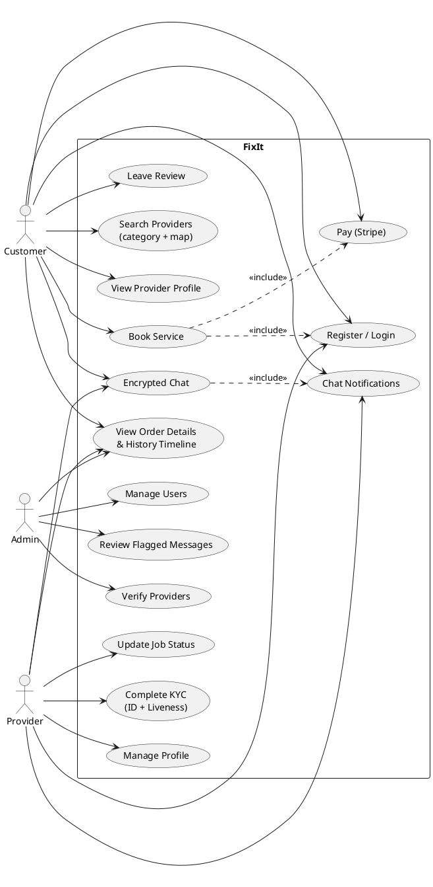

---

## Slide 10 — System Architecture Diagram

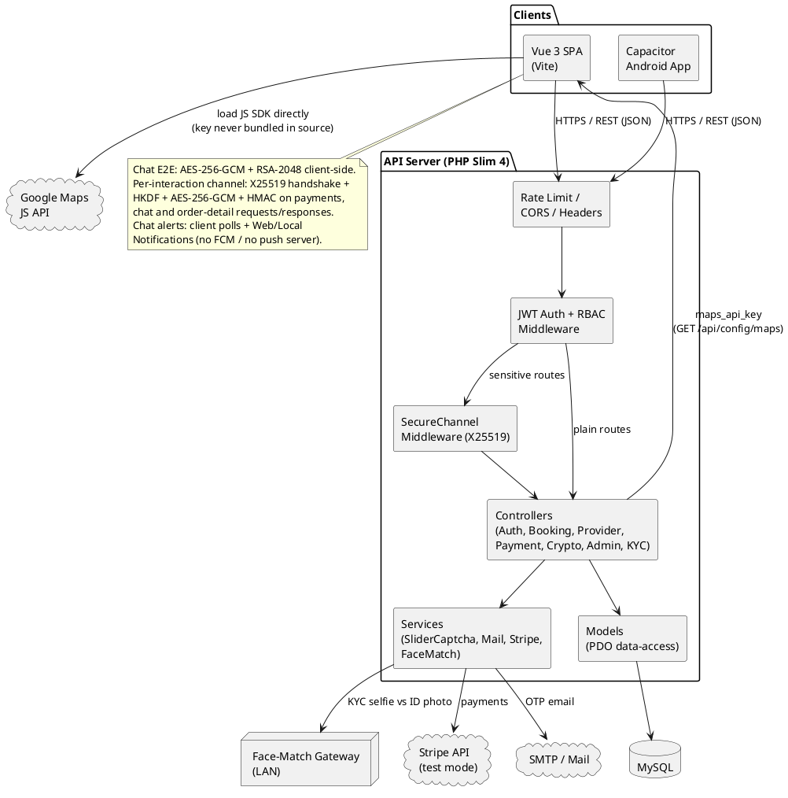

---

## Slide 11 — Sequence Diagram: Booking + Payment

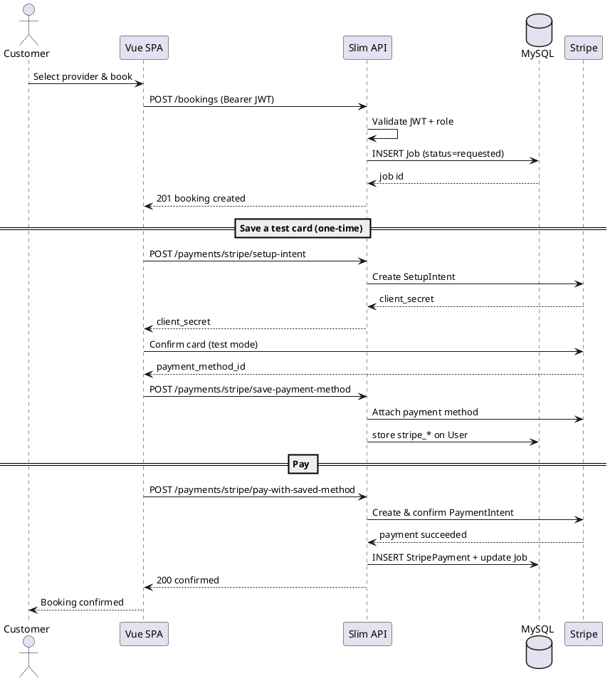

---

## Slide 12 — Sequence Diagram: E2E Encrypted Chat

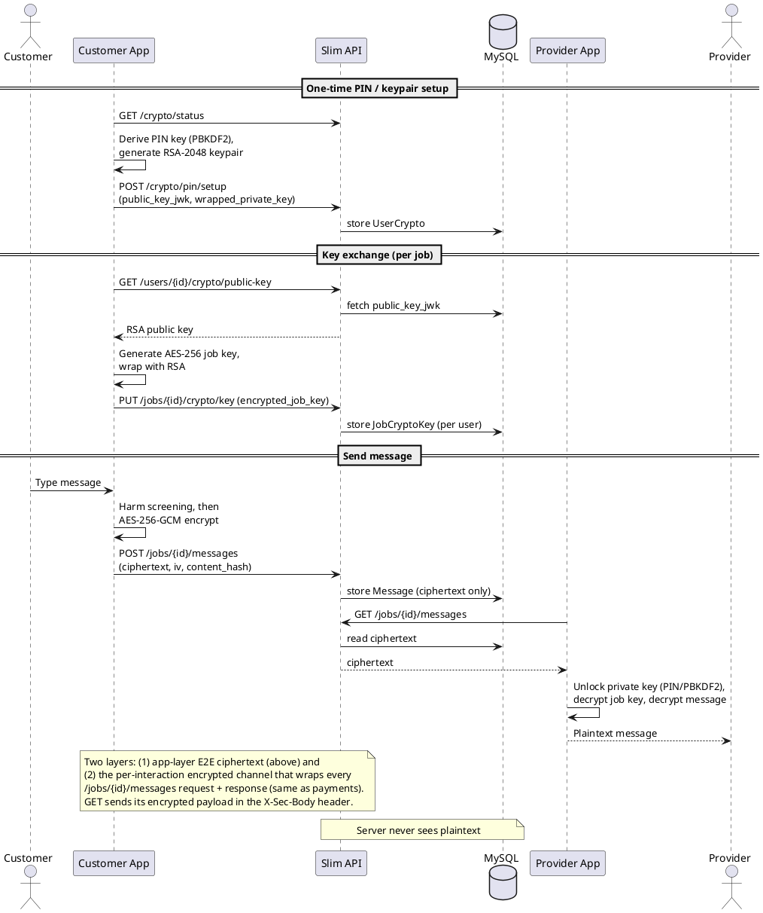

---

## Slide 13 — Activity Diagram: Provider KYC

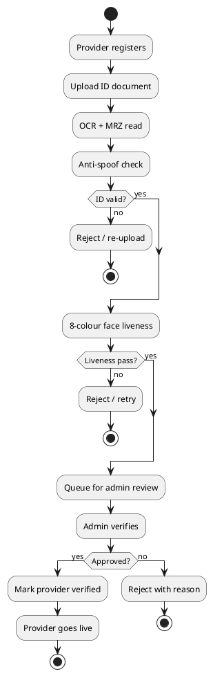

---

## Slide 14 — Deployment Diagram

> Includes the real CI/CD path: `.github/workflows/deploy.yml` runs on every push to `master` —
> one job SSHes into the server and redeploys, a second job builds and publishes a signed Android
> APK. `release-apk.yml` handles tagged (`v*`) milestone releases the same way.

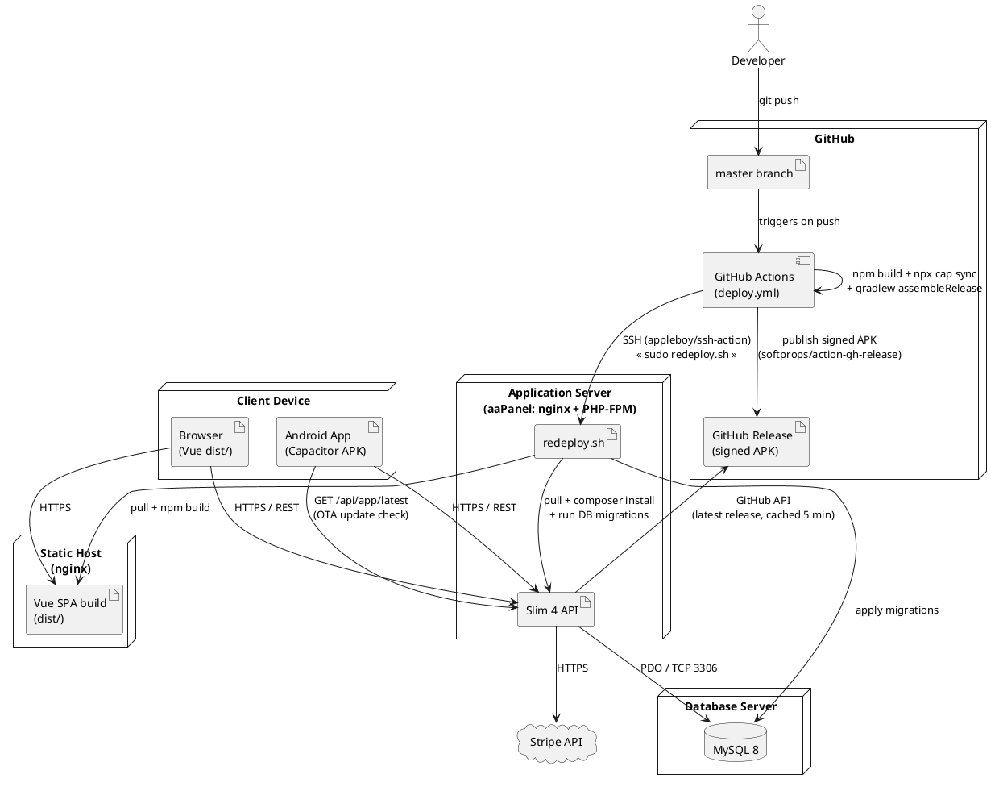

---

## Slide 15 — ER Diagram

> Exact to `schema.sql` + migrations (latest). Representative columns shown, not every column
> (e.g. `User` also holds Stripe-customer + legal-acceptance fields; `ProviderProfile` holds the
> full KYC column set). Auxiliary tables `EmailOtp`, `enc_session`, `enc_nonce` omitted for clarity.

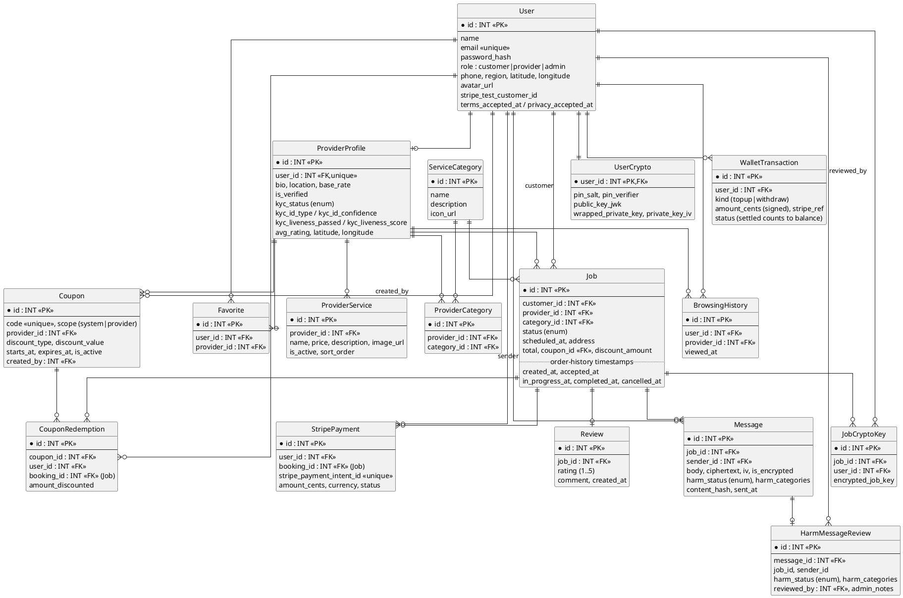

---

## Extra — Sequence Diagram: Per-Interaction Encrypted Channel

> The "encrypt like payment" channel, now also used for chat + order details.
> Reflected live in the floating Encryption Debug capsule.

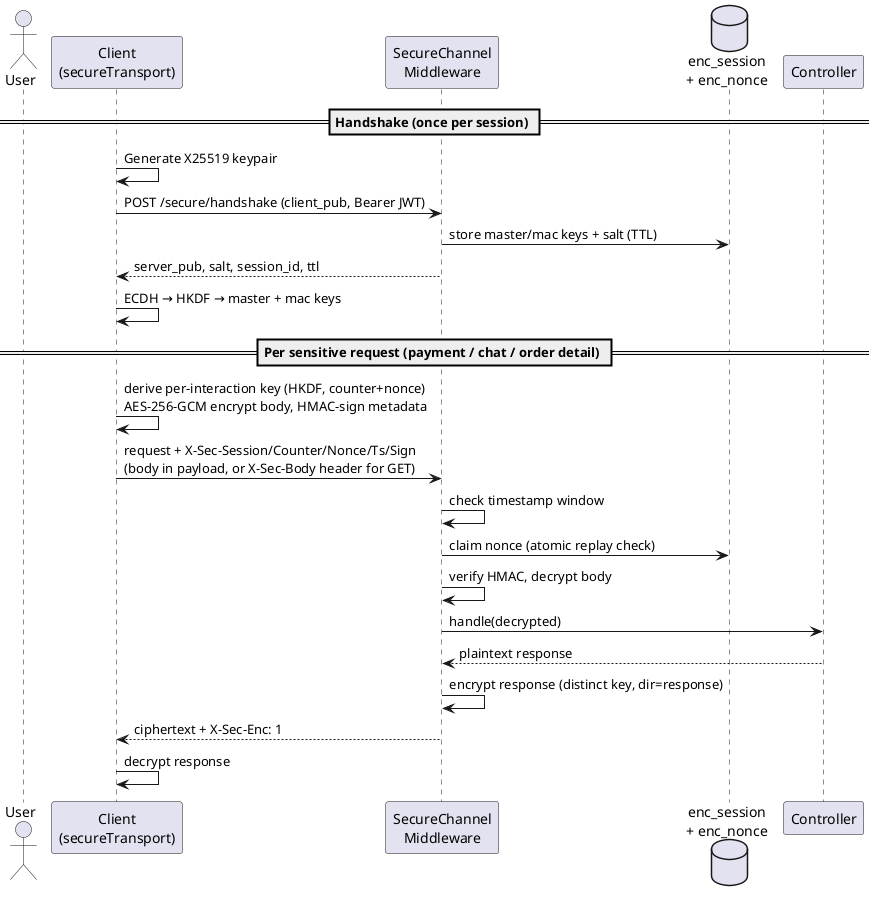

---

## Extra — Key Derivation & Encryption Pipeline (X25519 + HKDF + AES-256-GCM + HMAC)

> Companion to the sequence diagram above: that one shows *who calls whom*; this one shows what
> happens to the *data* — the actual key hierarchy and crypto operations, implemented identically
> in `secureTransport.js` (client) and `SecureChannelMiddleware.php` + `SecureChannel.php` (server).

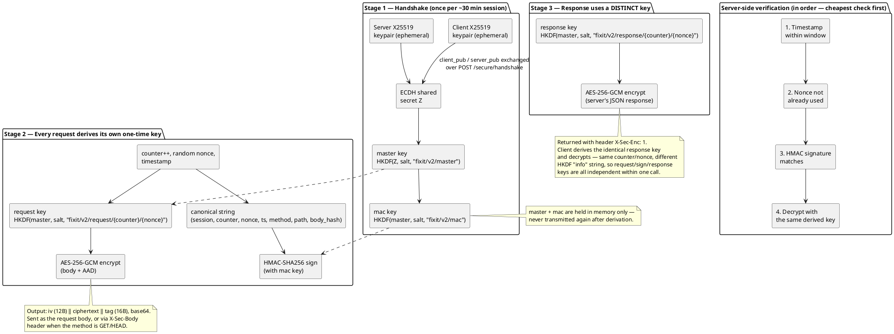

**Why this design, in one line each:**
- **X25519 ephemeral keys** → perfect forward secrecy: a leaked session key later can't decrypt past traffic, since each session's keypair is thrown away.
- **HKDF per counter+nonce** → every single request/response gets its own unique key, so no key is ever reused across two messages.
- **AES-256-GCM** → authenticated encryption: tampering with the ciphertext is detected, not just prevented from being read.
- **HMAC over a separate mac key** → the signature proves the *metadata* (path, method, timestamp) wasn't tampered with, independent of whether the body decrypts.
- **Nonce + timestamp window server-side** → replaying a captured request later, even unmodified, is rejected.

---

## Extra — Activity Diagram: Order Status & History Timestamps

> Each status transition stamps a Job timestamp (migration 022); the Order
> Details page renders them as a timeline (customer / provider / admin).

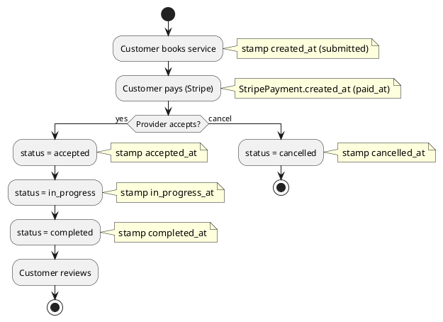

---

## Extra — Sequence Diagram: Direct Chat Notifications (no FCM)

> Client-side only — no Firebase, no push server, no device tokens. Fires while
> the app/tab is alive.

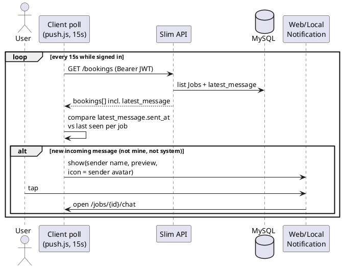
